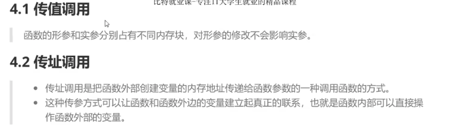
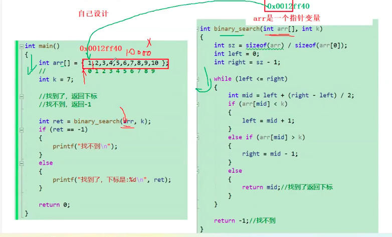
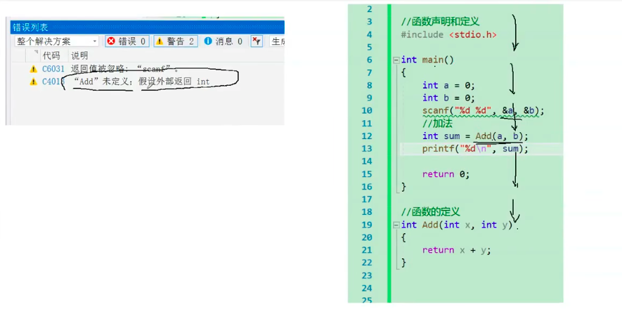
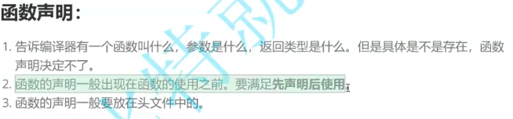
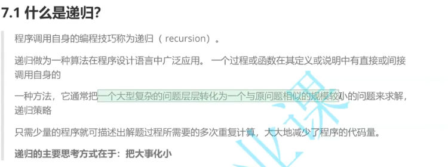
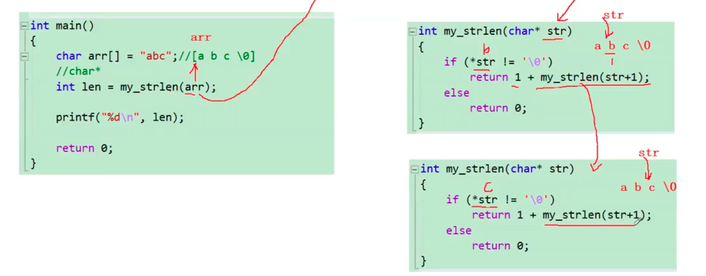
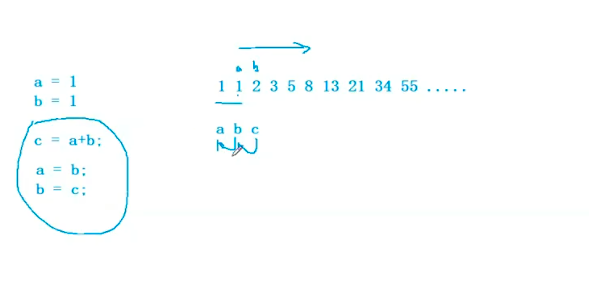
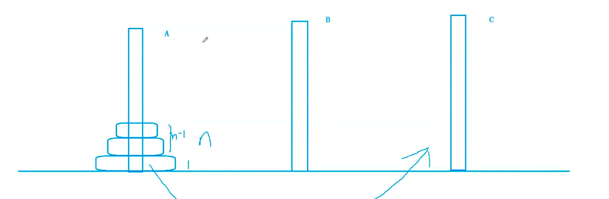

## 函数的传递

```c
include <stdio.h>

// void swap(int x,int y) {
//     int z = 0;
//     z = x;
//     x = y;
//     y = z;
// }
void swap2(int *x,int *y) {
    int z = 0;
    z = *x;交换前 a = 10, b = 20
交换后 a = 20, b = 10
a + b = 30

    *x = *y;
    *y = z;
}

int add(int x, int y) {
    int z = 0;
    z = x + y;
    return z;
}
int main() {
    int a = 0;
    int b = 0;
    scanf("%d %d", &a, &b);
    printf("交换前 a = %d, b = %d\n",a,b);
    // swap(a, b);
    swap2(&a,&b);
    printf("交换后 a = %d, b = %d\n",a,b);
    add(a, b);
    printf("a + b = %d\n",add(a,b));
}
print ： 交换前 a = 10, b = 20
交换后 a = 20, b = 10
a + b = 30

```



### 函数在传数组的只是指针变量



数组传参实际上传递的是数组首元素地址。

```c
int arr[] = {1,2,3,4,5,6,7,8,9,10};
int k = 7;
int sz = sizeof(arr)/sizeof(arr[0]);
//找到来返回下标
//找不到返回-1
int ret = binary_search(arr,k);int
    
 binary_search(int arr[],int k) {
```

### 嵌套调用，不能嵌套定义

```c
int ppp() {
    return 10;
}
void pp() {
    printf("%d",ppp());
}
int main() {
pp();
}
```

链式

```c
printf("%d",printf("%d",printf("%d",43))); 

print : 4321
```

## 声明和定义

函数定义需要在主函数上面，不如会扫不到，直接main的return的时候就结束程序，如果必须写在后面，需要在前面声明函数

```c
int Add(int x,int y);
int main() {
    int a = 0;
    int b = 0;
    scanf("%d %d",&a,&b);
    int sum =Add(a,b);
    printf("%d",sum);
}
int Add(int x,int y) {
    return x + y;
}
```



在项目中，声明放在.h文件里面，代码放在.c里面。主文件引用头文件

## 函数递归



```c
void print(unsigned int n) {
    if (n > 9) {
        print(n / 10);
    }
    printf("%d",n % 10);
}
int main() {
    unsigned int num = 0;
    scanf("%u", &num);
    print(num);
}
```

### 递归实现strlen

```c
int my_strlen(char *str) {
    if (*str != '\0') {
        return 1 + my_strlen(str + 1);
    } else {
        return 0;
    }
    //return *str != '\0' ? 1 + my_strlen(str + 1) : 0;
}
int main() {
    char *arr = "abc";
    int len = my_strlen(arr);
    printf("%d", len);
}
```



## 递归与迭代

#### n的阶乘

```c
if (n <= 1) {
    return 1;
} else {
    return n * fac(n - 1);
}
```

#### 求斐波那契数列

```c
int Fib(int n) {
    if (n <= 2) {
        return 1;
    } else {
        return Fib(n - 1) + Fib(n - 2);
    }
}
```

但是这种在一般情况是不可取的。

### 迭代实现斐波那契



```c
int Fib(int n) {
    int a = 1,b = 1,c = 0;
    while (n >= 3) {
        c = a + b;
        a = b;
        b = c;
        n--;
    }
    return c;
}
```

#### 汉诺塔

