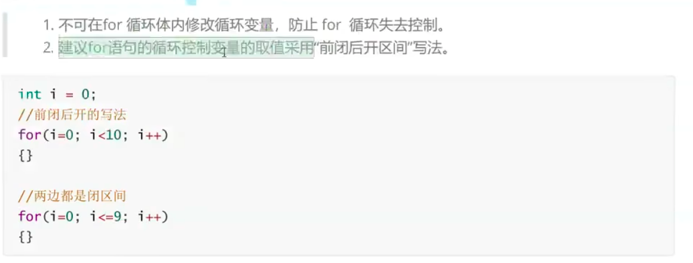
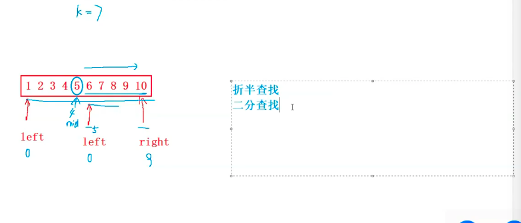

# 分支和循环

## if

```c
if (表达式) {
    语句1;
} else if{
    语句2;
} else {
    语句3;
}

```

C语言中else就近原则,嵌套的时候需要注意

## switch

```c
switch (day) {
    case 1:
        printf("星期一");
        break;
    case 2:
        printf("星期二");
        break;
    case 3:
        printf("星期三");
        break;
    case 4:
        printf("星期四");
        break;
    case 5:
        printf("星期五");
        break;
    case 6:
        printf("星期六");
        break;
    case 7:
        printf("星期日");
        break;
```

## while

```c
while (i <= 10) {
    printf("%d\n", i);
    i++;
}
		... ...
print : 1 2 3 4 5 6 7 8 9 10            
```

```c
ar password[20] = {0};
printf("input\n");
scanf("%s",password);
getchar();
printf("Y/N\n");
int ret = getchar();
if (ret == 'y') {
    printf("YES");
} else {
    printf("NO");
    }
```

不能有空格

```c
char password[20] = {0};
printf("input\n");
scanf("%s",password);
// getchar();
int ch = 0;

while ((ch = getchar()) != '\n');
printf("Y/N\n");

int ret = getchar();
if (ret == 'y') {
    printf("YES");
} else {
    printf("NO");
    }
```

可以有空格

```c
char ch = '0';
while ((ch = getchar()) != '') {
    if (ch < '0' || ch > '9')
            continue;
        putchar(ch);
```

getchar的应用

## for



```c
int i = 1;
while (i < 10) {
    printf("%d", i);
    i++;
}
printf("\n");
for (i = 1; i < 10; i++) {
    printf("%d",i);
}
int arr[10] = {1,2,3,4,5,6,7,8,9,10};
int i = 0;
for (i = 0; i < 10; i++) {
    printf("%d",arr[i]);
}
```

for嵌套


```c
int main() {
    int a = 0;
    for (int i = 0; i < 10; i++) {
        printf("\n");
        for(int j = 0; j < 10; j++) {
            printf("%2d|",a++);
        }
    }
}
print : 
 0| 1| 2| 3| 4| 5| 6| 7| 8| 9|
10|11|12|13|14|15|16|17|18|19|
20|21|22|23|24|25|26|27|28|29|
30|31|32|33|34|35|36|37|38|39|
40|41|42|43|44|45|46|47|48|49|
50|51|52|53|54|55|56|57|58|59|
60|61|62|63|64|65|66|67|68|69|
70|71|72|73|74|75|76|77|78|79|
80|81|82|83|84|85|86|87|88|89|
90|91|92|93|94|95|96|97|98|99|
```

## do while

```c
    int i = 1;
    do
        printf("%d\n", i);
    while (i++ < 10);
    return 0;
}
print : 1 2 3 4 5 6 7 8 9 10
```


## 数组

### 数组查找

```c
int main() {
    int arr[] = {1,2,3,4,5,6,7,8,9,10};
    int i = 0;
    int k = 7;
    int sz = sizeof(arr)/sizeof(arr[0]);
    for (i = 0; i < sz; i++) {
        if (arr[i] == k) {
            printf("下标是%d",i);
            break;
        }
        }
    if (i == sz) {
        printf("没有找到");
    }
}

print ： 下标是6
    但是在有序中，使用更好的下标
```



效率高的代码

```c
int left = 0; // 左边界
int right = sz - 1; // 右边界

while (left <= right) {
    int mid = (left + right) / 2; // 中间值下标
    if (arr[mid] < k) {
        left = mid + 1;
    } else if (arr [mid] > k) {
        right = mid - 1;
    }
    else {
        printf("下标是%d",mid);
        break;
    }
}
if (left > right) {
    printf("没有找到");
}
print : 6

```

### 面向结果的编程


```c
#include <stdio.h>
#include <stdlib.h>
#include <string.h>
#include <unistd.h>

int main() {
    char arr1[] = "welcome to C !!!";
    char arr2[] = "################";

    int left = 0;
    int right = strlen(arr1)-1;
    // int right = sizeof(arr1)/sizeof(arr1[0])-2;

    while (left <= right) {
        arr2[left] = arr1[left];
        arr2[right] = arr1[right];
        printf("%s\n",arr2);
        sleep(1);
        system("clear");
        left ++;
        right --;
    }
    return 0;
}
```

ps  ：代码不难，就是这个头文件。。。


