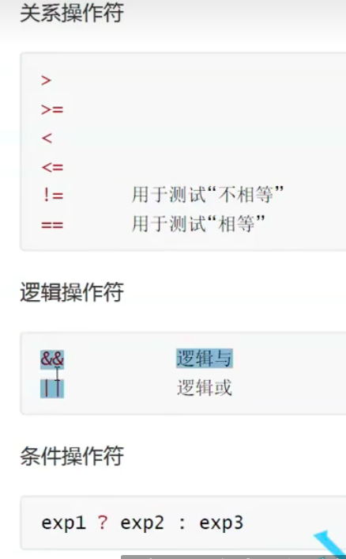
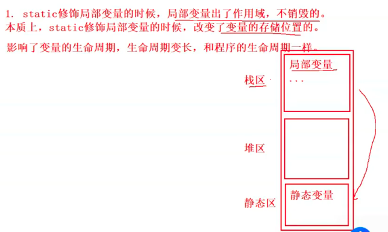

# 第一个C语言程序

## 变量

### 局部变量

生命周期

局部变量的生命周期是进入作用域生命周期开始，出作用域生命周期结束


### 全局变量

生命周期

主函数开始执行，程序生命开始。主函数结束，程序结束。

## 常量

### 字面常量


### onst修饰的常变量（无法修改）

在C语言中，const修饰的a,本质是变量，但是不能被修改，有常量的属性

 

const修饰的n本质是变量，但是是常属性。

### define 定义的标识符常量

可以理解为全局常变量（没有类型）就是define定义的只是一个符号，并不是像变量一样的值，在程序中遇到这个符号就自动替换为对应的值，统一通俗的理解为as或者当前程序输入的别名，假如有人叫张三，每次写日记多次就可以定义一个zs 以后就不需要在输入张三，就可以输入zs。

```c
#define zs "张三" 
```


### 枚举常量

```C
enum Color {
    //枚举常量
    RED,
    GREEN,
    BLUE
};
int main() {
    //三原色
    //Red Green Blue
    int num = 10;
    enum Color r = RED;
}
```


变量的可能取值，但是无法取枚举以外的值

## 字符

### 字符类型

存储字符的类型

```c
char a = 'a';
```

### 字符串

在C语言中没有确切的字符串，但是可以用字符数组存储

```c
char arr1[] = {"hello word"}; --> h e l l o  w o r d \0
```

**字符串结束表示是"\0"**

```c
char arr1[] = {"hello word"};
char arr2[] = {'h','e','l','l','o',' ','w','o','r','d'};
	printf("%s\t\t%s",arr1,arr2);
							... ...
 输出结果 hello word		hello wordhello word
```

```c
char arr1[] = {"hello word"};
char arr2[] = {'h','e','l','l','o',' ','w','o','r','d','\0'};
printf("%s\t\t%s",arr1,arr2);
						... ...
输出结果 hello word		hello word                    
```

```c
printf("\n%d\t%d",strlen(arr1),strlen(arr2));
			... ...
print: 10	109                
```

arr1有结束标志"\0"，发现"\0"就打印完毕，但是arr2会跃出arr2的范围找到"\0为止"，这里有打印了一编是因为他两内存挨着，巧合。"\0是转译字符"

### [转译字符](https://blog.csdn.net/m0_74102736/article/details/129342417)

\n \t \0 等等


这里打印\n识别为换行

| 序号 | 转义字符 |         转义功能          | ASCII码值 |
| :--: | :------: | :-----------------------: | :-------: |
|  1   |    \0    |          空字符           |     0     |
|  2   |    \a    |           响铃            |     7     |
|  3   |    \b    |      退格(Backspace)      |     8     |
|  4   |    \t    |         退格(tab)         |     9     |
|  5   |    \n    |        换行(Enter)        |    10     |
|  6   |    \v    |         竖向跳格          |    11     |
|  7   |    \f    |           换页            |    12     |
|  8   |    \r    |           回车            |    13     |
|  9   |    \"    |          双引号           |    34     |
|  10  |    \'    |          单引号           |    39     |
|  11  |    \?    |           问好            |    63     |
|  12  |    \\    |      反斜线字符（\）      |    92     |
|  13  |   \ddd   |  1~3位八进制所代表的字符  |           |
|  10  |   \xdd   | 1~2位十六进制所代表的字符 |           |

假如我想打印windowsC盘下面test下面的test.c+

 文件那么如果我直接打印是打印不出来的，这个时候就需要添加两个斜杠

例

```c
printf("C:\tese\test.c");
		... ...
print : C:	ese	est.c
    
printf("C:\\tese\\test.c");
		... ...
print : C:\test\test.c            
```

### 注释

在c语言中，注释有

```
/*int a = 10;
 *
 *
 */
 无法嵌套
 
 
 
 //int a = 10;
 //int a = b;
```

## 循环语句

c语言中有while循环、for、do while循环

## 函数

f(x) = 2*x+1;


给x什么值可以到到不同的结果，c语言中可以理解为工厂，给原材料经过工厂得到结果


## 数组

### 数组定义


数组在内存中拥下标读取，但是C语言中是从0开始数的，例如我想读12就

```c
printf("%d",arr[2]);
```

### 读取下标

```c
while (i < 10) {
    printf("%d\t",arr[i]);
    i++;
}
		... ...
0	1	2	3	4	5	6	7	8	9	            
```

## 操作符

### 运算操作符

```c
+ - * / %
```

运行基本的数学运算

```c
int a = 7 / 2;
int b = 7 % 2;
float c = 7.0 / 2;

```

### 位移操作符

```c
>> <<
```

涉及二进制

### 赋值操作符

```c
= += -= *= /= &= ^= |= >>= <<=
```

```c
a = a + 3;
a += 3

a = a - 3;
a -= 3;
```

### 单目操作符

### 

在c语言中，0表示假，非零表示真

#### sizeof

```c
printf("%d",sizeof(a)); //4
printf("%d",sizeof(int)); //4
printf("%d\n",sizeof a); //4
int arr[10] = {0};
printf("%d\n",sizeof arr); //40
printf("%d\n",sizeof arr[0]); //4
printf("%d",sizeof arr / sizeof arr[0]); //10

```

### 双目操作符



### 逗号表达式


```c
int d = (c=a-2,a=a+b,c-3);
//       c=8   a=28  c=5
printf("%d",d);
			... ...
ptintf : 5
```

## 常见关键字


### typedef  

类型重命名

```c
typedef unsigned int uint;
int main() {
unsigned int mum = 0;
    uint num = 1;
}
```


### static (static = 长寿丹)


#### 局部变量

使用的时候作用域变小了，无法使用外部连接属性

```c
void test() {
    int a = 1;
    a++;
    printf("%d\t",a);
}
int main() {
    int i = 0;
    while (i < 10) {
        test();
        i++;
    }
    return 0;
}
		... ...
print : 2 2 2 2 2 2 2 2 2 2         
```


```c
	...	...
static int a = 1;
	...	...
print : 2 3 4 5 6 7 8 9 10 11        
```



#### 全局变量


static修饰全局变量的时候全局变量的外部连接属性变成了内部连接属性，其他源文件(.c)就不能在使用全局变量。

如果定义一开始 static int g_val = 2022编译就会报错，未识别g_val

#### 函数

性质和全局类似，一个函数本来是具有外部连接属性的，但是被static修饰之后，外部连接属性就变成了内部链接属性，其他源文件(.c)无法使用。

### register


#define 定义常量和宏

宏是完成替换的


## 指针

```c
int a =10; // 向内存堆申请一个int大小的空间，并将a的值赋给该空间
int *p = &a; //取地址a
```

## 结构体-struct

结构体是把一些单一类型组合在一起的做法

```c
struct Stu {
    //结构体成员
    char name[20];
    int age;
    char sex[10];
    char tele[12];
};
int main() {
    struct Stu s = {"zhangsan",20,"man","123456789"};
    printf("%s %d %s %s\n",s.name,s.age,s.sex,s.tele);
    return  0;
}
		...	...
print : zhangsan 20 man 123456789            
```

使用指针的结构体

```c
void print(struct Stu* ps) {
    printf("%s %d %s %s\n",(*ps).name,(*ps).age,(*ps).sex,(*ps).tele);
}
//结构梯对象.成员名
			... ...
 int main(){
            ...	...
          print(&s);
        }
print : zhangsan 20 man 123456789      
```

但是这样的写法有写有点麻烦，vido的函数可以更简洁

```c
vido ... ...    
printf("%s %d %s %s\n",ps->name,ps->age,ps->sex,ps->tele);
//结构体指针变量->成员名
```

前提条件是得到指针变量

