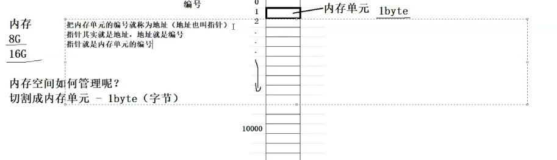

# 指针

指针是什么？

指针理解的2个要点：

1.指针是内存中一个最小单元的编号，也就是地址

2.平时口语中说的指针，通常指的是指针变量，是用来存放内存地址的变量总结：指针就是地址，口语中说的指针通常指的是指针变量。



# 指针和指针类型

关于使用int指针访问char指针的问题
在C语言中，不同类型的指针指向不同类型的对象，它们的大小和解释方式也不同。直接用int指针访问char指针是不安全且不符合类型系统的规范，可能会导致未定义行为（Undefined Behavior）。以下是详细解释：
1. int指针与char指针的区别
    int *：指向一个整型数据，通常占用4个字节（32位系统）或8个字节（64位系统），具体取决于平台。
    char *：指向一个字符数据，通常占用1个字节。

2. 类型不匹配的风险
    内存对齐：int类型的变量在内存中通常需要按其大小对齐（例如4字节对齐），而char类型没有这种要求。如果用int指针访问未对齐的char数组，可能会导致性能问题甚至硬件异常。
    数据解释错误：int指针会将连续的多个字节解释为一个整数，而char指针每次只解释一个字节。如果你用int指针访问char指针指向的数据，可能会读取到错误的值。
    未定义行为：C标准规定，不同类型指针之间的强制转换和解引用可能导致未定义行为，特别是在不同类型的对象之间进行不当的指针算术操作时。

3. 正确的做法
    如果你想处理不同类型的指针，应该使用适当的类型转换，并确保理解你正在做什么。以下是一些常见的做法：
    逐字节访问：如果你确实需要逐字节访问一个int变量，可以使用char指针来实现：

  # 野指针

 未初始化的指针或是函数销毁的的指针称之为野指针

```c
int* text() {
    int a = 10;
    return &a;
}
int main () {
    int *p = text();
    printf("%d\n", *p);

    return 0;
}
```

## 避免野指针的出现

1.指针初始化

2.小心指针越界

3.指针指向空间释放即使置NULL

4.避免返回局部变量的地址

5.指针使用之前检查有效性

# 指针运算

```c
#define N_V 5
float values[N_V]
float* vp
for (vp = values[0]; vp < &values) {
        *vp++ = ;
}
*vp++   等于    *vp=0,vp++;
```

