## 操作符的分类

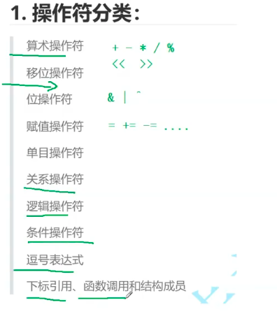

### 算术操作符

```c
+ - * / %
```

```c
int a = 7 % 2 ;
printf("%d\n", a);
a = 7 / 2;
printf("%d\n", a);
print : 1 
    	3
```

### 正数移位操作符

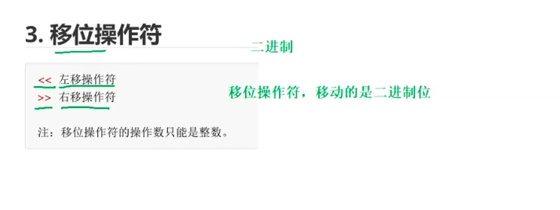

```c
int main () {
    int a = 7;
    // 左移操作符
    int b = a << 1;
    printf("%d\n", a);
    printf("%d\n", b);
}
print : 7 
    	14
```

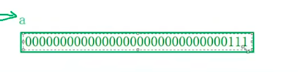

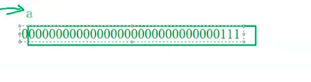

左移操作符 左边丢弃，右边补0

### 负数移位操作符

```c
int main () {
    int a = -7;
    int b = a << 1;
    printf("%d\n", a);
    printf("%d\n", b);
}
print : -7 
    	-14
```

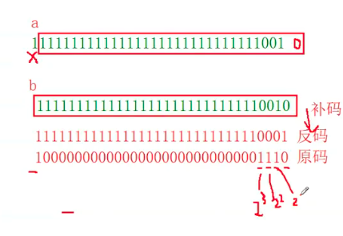

### 右移

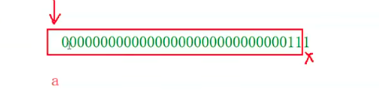

右边丢弃，左边补原符号

```c
int main () {
    int a = 7;
    int b = a >> 1;
    printf("%d\n", a);
    printf("%d\n", b);
}
7 3
```

### 位与操作符   &  ^  |

#### &

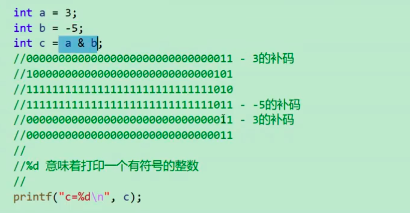

#### ^

```C
    printf("a = %d, b = %d\n",a,b);
    a = a ^ b;
    b = a ^ b;
    a = a ^ b;
    printf("a = %d, b = %d\n",a,b);
}
交换a和b的数值
```

### 赋值操作符

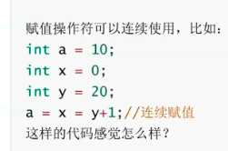

右到左

## 单目操作符

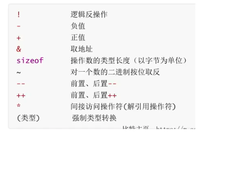

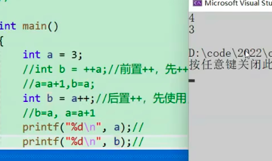

###   关系操作符

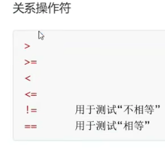

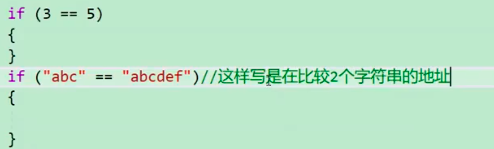

比较字符串用strcmp

#### 逻辑与逻辑或

```c
int a = 3;
int b = 5;
int c = a && b;
printf("%d\n", c);
```

可以把&&理解为便且

a 和 b 只要有一个为假都为假

```c
int main () {
    int a = 3;
    int b = 5;
    int c = a || b;
    printf("%d\n",c);
```

只要a 和 b 有一个为真就为真，两个为假则是假

```c
int i = 0, a = 0, b = 2, c = 3, d = 4;
i = a++ && b ++ && d ++;
printf("a = %d\n b = %d\n c = %d\n d = %d\n",a,b,c,d);
1 2 3 4
```

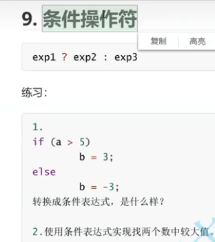

### 逗号表达式

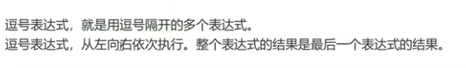


### 结构体和

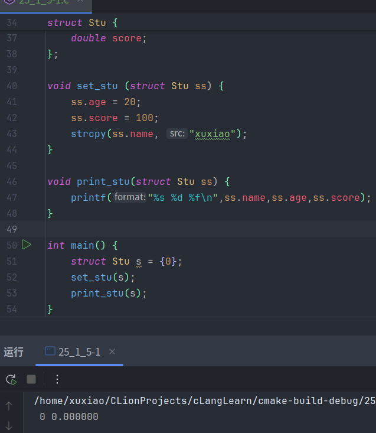

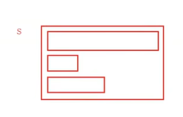

值没有到s。

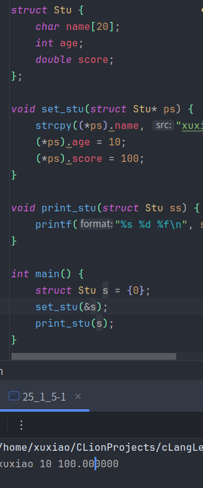

要使用指针

```c
void set_stu(struct Stu* ps) {
    // strcpy((*ps).name, "xuxiao");
    // (*ps).age = 10;
    // (*ps).score = 100;
    strcpy(ps->name, "xuxiao");
    ps->age = 10;
    ps->score = 100;
}
```

```c
ps->age = (*ps).age
```

