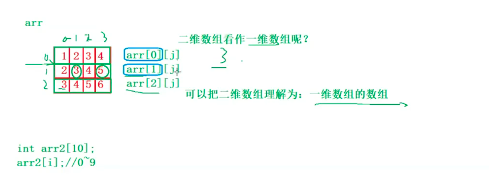

## 一维数组

数组是存放多个相同类型的集合

```c
 	int arr[] = {0};
    char arr1[] = {0};
    double date[1+1] = {0};
	float date1 [i] = {0};
 	char ch[5+5];
    int n = -10;
    double date[20 + n];
    
```

c99之前数组必须是常量，c99之后可以是变量，为了支持变长数组 ,但是数组不能初始化，或者是赋值

一维数组在内粗是连续的。

## 二维数组

```c
int arr[3][4] = {{1,2,3,4},{5,6,7,8},{9,10,11,12}};
int arr [][4] = {0};
char arr2[5][10];
```

初始化的时候可省略行，不能省略lie


把二维数组理解为多个一维数组



### 二维数组在内存中


二维数组在内存中也是连续存放的


## 数组越界

有时候编译器不报错


数组的下规定是从0开始的，如果数组有n个元的了出了数组合法空间的访问。数组的下标是有范围限制的。

## 冒泡排序

```c
void bubble_sort(int arr[] ,int sz) {
    //大小可写可不写，但是必须指点是数组
    for (int i = 0; i < sz - 1; ++i) {
        for (int j = 0; j < sz - 1 - i; ++j) {
            if(arr[j] > arr[j + 1]) {
                int temp = arr[j];
                arr[j] = arr[j + 1];
                arr[j + 1] = temp;
            }
        }
    }
}
```

### 数组名


